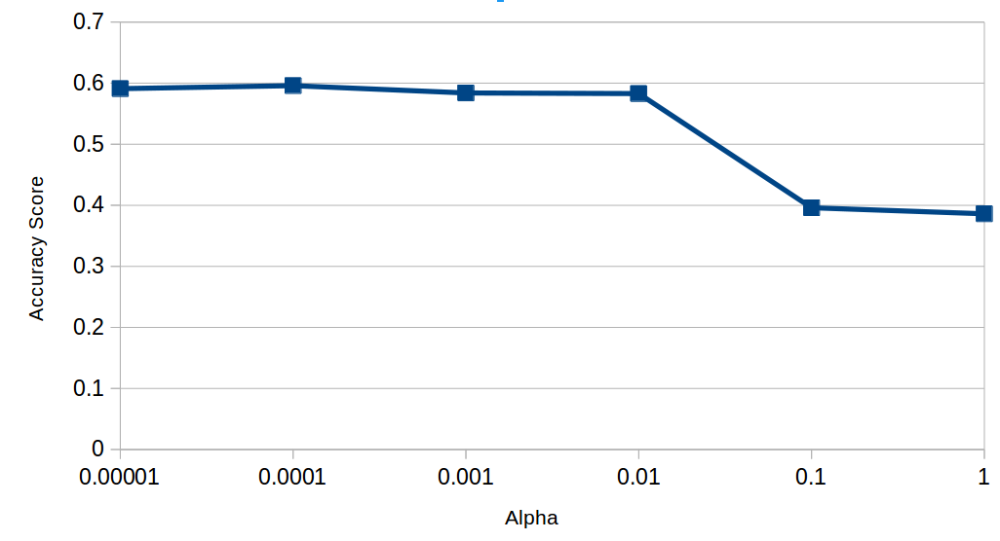
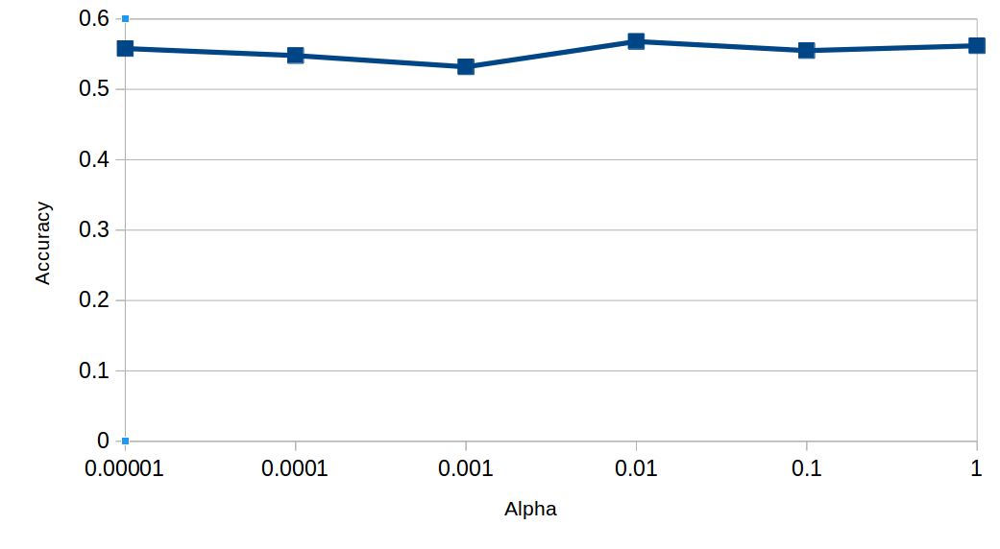

# Machine Learning - Assignment 3

## 1. Data & Pre-processing

The task was to develop a system that predicts the gender of a Twitter user. The dataset contains many instances where the gender feature was labelled as "unknown" or had no label at all. When training our model, we wanted to avoid teaching the model to identify users with an unknown gender. Therefore, the instances with no gender label or with an "unknown" label were removed from the dataset, leaving only male, female and brand as possible genders.

## 2. Algorithm & Feature Selection

Our system is divided into 2 main sections - text processing and number processing.

### 2a. Text Processing

In text processing, we investigated if the profile's description could be used as an indication of the profile user's gender. We tested three algorithms, Multinomial Naïve Bayes Classifier (MNB), Stochastic Gradient Descent Classifier (SGDC), Multi-layer Perceptron Classifier (MLP).

We used the "description" feature as our variable and "gender" as our target. The text of the descriptions was tokenized and a dictionary was built which mapped the occurrences of different words to the gender. This was done through Scikit's Count Vectorizer. We took this approach because attempting to classify the gender according to whole texts or sentences is inaccurate and inefficient. Through tokenization, we were able to reframe the problem from a text classification to a number classification. Finally, we used TF-IDF to convert term occurrences into term frequencies associated with the genders.

Next was choosing the best parameters. We ran a grid search cross validation on all three algorithms to find the parameters that gave the best accuracy score for each algorithm. The parameters that produced that highest accuracy are highlighted in bold in their tables. For SGDC and MLP, we decided to keep TF-IDF and N-gram Range constant at TRUE and (1,2) respectively. We then tested which alpha value would be best for these conditions. The results of these tests are displayed in Figure 1 and Figure 2.

#### Multinomial Naïve Bayes Classifier parameters

| Accuracy | Alpha | Fit Prior | Use TF-IDF | N-gram Range |
| --- | --- | --- | --- | --- |
| 0.594 | 0.10 | TRUE  | TRUE  | (1, 1) |
| 0.600 | 0.10 | TRUE  | TRUE  | (1, 2) |
| 0.604 | 0.10 | TRUE  | FALSE | (1, 1) |
| 0.606 | 0.10 | TRUE  | FALSE | (1, 2) |
| 0.585 | 0.10 | FALSE | TRUE  | (1, 1) |
| 0.590 | 0.10 | FALSE | TRUE  | (1, 2) |
| 0.596 | 0.10 | FALSE | FALSE | (1, 1) |
| 0.596 | 0.10 | FALSE | FALSE | (1, 2) |
| 0.601 | 0.25 | TRUE  | TRUE  | (1, 1) |
| 0.605 | 0.25 | TRUE  | TRUE  | (1, 2) |
| 0.608 | 0.25 | TRUE  | FALSE | (1, 1) |
| 0.608 | 0.25 | TRUE  | FALSE | (1, 2) |
| 0.594 | 0.25 | FALSE | TRUE  | (1, 1) |
| 0.596 | 0.25 | FALSE | TRUE  | (1, 2) |
| 0.598 | 0.25 | FALSE | FALSE | (1, 1) |
| 0.599 | 0.25 | FALSE | FALSE | (1, 2) |
| 0.606 | 0.50 | TRUE  | TRUE  | (1, 1) |
| 0.609 | 0.50 | TRUE  | TRUE  | (1, 2) |
| 0.608 | 0.50 | TRUE  | FALSE | (1, 1) |
| 0.609 | 0.50 | TRUE  | FALSE | (1, 2) |
| 0.599 | 0.50 | FALSE | TRUE  | (1, 1) |
| 0.599 | 0.50 | FALSE | TRUE  | (1, 2) |
| 0.600 | 0.50 | FALSE | FALSE | (1, 1) |
| 0.601 | 0.50 | FALSE | FALSE | (1, 2) |
| 0.608 | 0.75 | TRUE  | TRUE  | (1, 1) |
| **0.609** | **0.75** | **TRUE**  | **TRUE**  | **(1, 2)** |
| 0.606 | 0.75 | TRUE  | FALSE | (1, 1) |
| 0.608 | 0.75 | TRUE  | FALSE | (1, 2) |
| 0.600 | 0.75 | FALSE | TRUE  | (1, 1) |
| 0.601 | 0.75 | FALSE | TRUE  | (1, 2) |
| 0.599 | 0.75 | FALSE | FALSE | (1, 1) |
| 0.599 | 0.75 | FALSE | FALSE | (1, 2) |
| 0.608 | 1.00 | TRUE  | TRUE  | (1, 1) |
| 0.607 | 1.00 | TRUE  | TRUE  | (1, 2) |
| 0.605 | 1.00 | TRUE  | FALSE | (1, 1) |
| 0.606 | 1.00 | TRUE  | FALSE | (1, 2) |
| 0.600 | 1.00 | FALSE | TRUE  | (1, 1) |
| 0.602 | 1.00 | FALSE | TRUE  | (1, 2) |
| 0.597 | 1.00 | FALSE | FALSE | (1, 1) |
| 0.599 | 1.00 | FALSE | FALSE | (1, 2) |

#### Stochastic Gradient Descent Classifier parameters

| Accuracy | Alpha | Use TF-IDF | N-gram Range |
| --- | --- | --- | --- |
| 0.587 | 0.001  | TRUE  | (1, 1) |
| 0.586 | 0.001  | TRUE  | (1, 2) |
| 0.569 | 0.001  | FALSE | (1, 1) |
| 0.571 | 0.001  | FALSE | (1, 2) |
| 0.602 | 0.0001 | TRUE  | (1, 1) |
| **0.603** | **0.0001** | **TRUE**  | **(1, 2)** |
| 0.597 | 0.0001 | FALSE | (1, 1) |
| 0.600 | 0.0001 | FALSE | (1, 2) |



#### Multi-layer Perceptron Classifier parameters

| Accuracy | Alpha | Use TF-IDF |
| --- | --- | --- |
| 0.527 | 0.0001   | TRUE  |
| 0.517 | 0.0001   | FALSE |
| **0.567** | **0.00001**  | **TRUE**  |
| 0.561 | 1.00E-05 | FALSE |



### 2b. Number Processing

In number processing, we used the SVM algorithm using the fav_number, tweet_count, link_color and sidebar_color as our independent features. Of course, gender was our target feature.
The link_color and sidebar_color features are hex values and so, for number processing, we converted the hex value into three numeric features representing the red, green and blue values of the colours. Finally, the features used were normalised.
These edited features were then used to train the model and make predictions.
The kernel we used was the default radial basis function kernel. We tested multiple available kernels (radial basis function, linear, polynomial, sigmoid) but we observed no major difference in their accuracy scores.

### 2c. Combining Text and Number Processing

To combine our text and number machine learning algorithms, we used the output of our text learning algorithm as input to our number learning algorithm.
To do this, we first trained our text classifier on the text columns in the training dataset, then added the results of this to the dataset using one-hot encoding before training the number classifier on the resulting numeric columns in the dataset.
To test, we use the trained text classifier to predict the gender for the test datas text columns, then ran the trained number classifier on the resulting numeric data to get our accuracy score.

## 3. Evaluation

### 3a. Text Processing

From Section 2a, we have the best parameters for each of the three text processing algorithms. We compared these three algorithms against each other to identify which one provides the most accurate results. We performed a 3-fold cross validation. We found that MNB classifier is the most accurate. However, the accuracy is only 0.565. Although it is better than guessing the gender randomly (33% chance of being correct), it is not reliable enough for a prediction system.

#### Text Classification Algorithm accuracies

| MNB | SGDC | MLP |
| --- | --- | --- |
| 0.565 | 0.525 | 0.506 |

### 3b. Number Processing

As a baseline, we first trained the SVM using just the obvious number features as inputs, ‘fav_number’ and ‘tweet_count’ (retweet_count didn't seem to contain useful information).
With these inputs we got an accuracy of 46.7% from 5-fold cross validation, better than guessing between the 3 genders, but far from ideal. Using different kernels for the SVM had almost no impact on accuracy in our testing, but normalising the data increased our accuracy to 48.9%.

We then added the link and sidebar colors. First we simply added the the colors as numbers to the number classifier, and this actually decreased the accuracy by 2-3%. We then decided to split the colors into separate red, green and blue features in order to more accurately represent the colors. Training with this data increased our accuracy to 53.8%.

### 3c. Text and Number Processing

When combining our text and number classifiers, we first converted the ‘features’ column to ‘features_male’,  ‘features_female’ and ‘features_brand’ columns using one-hots encoding.
After training the number classifier on the resulting data, our accuracy jumped to 61.0%.
However, adding the ‘text’ column (the text from a random tweet) actually decreased the accuracy to around 53%. We believe that the high variance in the content of a randomly selected tweet made it hard for the text classifier to produce good results, and a larger training dataset would be required to get good accuracy from that field.
With this in mind, we decided to stick to using only the ‘description’ column, as the lesser variance in content allow for higher text classifier accuracy.

## 4. Conclusion

The final implementation of the prediction system (i.e. the combined text and number processing) produced a mean accuracy of 61%. This system would suit an application where a large margin of error is allowed for example, personalised advertising. In this case if the add is targeting the wrong person, the ad is simply ignored. However, we do not recommend this system for application where a small margin of error is allowed, for example, titling direct messages to the user. Addressing a man as “Madame” or woman as “Sir” may offend the recipient of the message.

We believe that our approach can be improved. If multiple tweets rather than one random tweet was taken from the user, the quality of the input can be improved and potentially increase the accuracy of the system. Furthermore, we did not use the profile image of the user. Adding these images to the input data could also increase the accuracy of our system.

## 5. Appendix

| Name | Student # | Contributions | Time Spent (HRS) |
| ----- | ---------- | ------------------------------------------------ | -------- |
| Jinwei Yuan | 17306137 | Main developer of the text processing code - developed multinominal naive bayes, linear SVM and MLP classifiers | 20 |
| Simon Quigley | 13327420 | Main developer of the number processing code - developed numeric SVM classifier and integrated the text and number classifiers | 15 |
| Patrick Geoghegan | 13320590 | Assisted in development, analysis of results and writer of report | 12 |

## 6. Source Code
Main.py
```python

from sklearn import svm, metrics, preprocessing
import csv
#import _pickle
import random
from sklearn.model_selection import train_test_split, cross_val_score

from sklearn.utils import shuffle
from sklearn import neighbors
from sklearn.feature_extraction.text import TfidfVectorizer
from sklearn.feature_extraction.text import CountVectorizer
from sklearn.feature_extraction.text import TfidfTransformer
from sklearn.naive_bayes import MultinomialNB
from sklearn.naive_bayes import GaussianNB
from sklearn.naive_bayes import BernoulliNB
from sklearn.neural_network import MLPClassifier
from sklearn.model_selection import GridSearchCV
from sklearn.linear_model import SGDClassifier
from sklearn.svm import LinearSVC
from sklearn.model_selection import cross_val_score
from sklearn.pipeline import Pipeline
from sklearn.model_selection import train_test_split
from sklearn.metrics import classification_report
import numpy as np


def dataset_from_csv(datafile, independent_columns, color_columns, text_columns, dependent_column, valid_classes):
    independent_vars = []
    dependent_vars = []

    with open(datafile) as csvfile:
            datagen = csv.reader(csvfile, delimiter=',')
            column_heads = next(datagen)
            # Get Indexes of used columns
            independent_indexes = [column_heads.index(x) for x in independent_columns]
            color_indexes = [column_heads.index(x) for x in color_columns]
            text_indexes = [column_heads.index(x) for x in text_columns]
            dependent_index = column_heads.index(dependent_column)

            for row in datagen:
                if row[dependent_index] in valid_classes: #Only take known genders
                    # split colors into seperate rgb values
                    rgbs = []
                    for x in color_indexes:
                        try:
                            r = int(row[x][:2], 16)
                            g = int(row[x][2:4], 16)
                            b = int(row[x][4:], 16)
                            rgbs.append(r)
                            rgbs.append(g)
                            rgbs.append(b)
                        except ValueError:
                            rgbs += [0,0,0]

                    independent_vars.append(([row[x] for x in text_indexes] + [int(row[x]) for x in independent_indexes] + rgbs))
                    dependent_vars.append(row[dependent_index])
    return independent_vars, dependent_vars


datafile = 'twitter_gender.csv'
independent_columns = ['fav_number', 'tweet_count']
color_columns = ['link_color', 'sidebar_color']
text_columns = ['description']
dependent_column = 'gender'
valid_classes = ['male', 'female', 'brand']

independent_vars, dependent_vars = dataset_from_csv(datafile, independent_columns, color_columns, text_columns, dependent_column, valid_classes)


### Text Processing
def train_text_cls(dataset, target, numrows):
    text_classifiers = []
    for i in range(0, numrows): #Create text classifier for each text column
        mnb_clf = Pipeline([('vect', CountVectorizer()),
                            ('tfidf', TfidfTransformer()),
                            ('clf',  MultinomialNB()),
                            ])
        mnb_parameters = {'vect__ngram_range': [(1, 2)],
            'tfidf__use_idf': ([True]),
            'clf__alpha': ([0.75]),
            'clf__fit_prior': ([True]),
            }

        gs_clf = GridSearchCV(mnb_clf, mnb_parameters, n_jobs=-1,cv=3)
        gs_clf.fit([x[i] for x in dataset], target)
        text_classifiers.append(gs_clf)
    return text_classifiers


def process_text(dataset, clfs, numrows):

    for row in dataset:
        for clf in range(0, numrows):
            pred = clfs[clf].predict([row[clf]])[0]
            new_vals = [0,0,0]
            new_vals[valid_classes.index(pred)] = 1
            row += new_vals

    dataset = preprocessing.scale([x[numrows:] for x in dataset])

    return dataset

def split_test(indep_vars, dep_vars, test_size=0.3, offset=0):
    start = int(len(dep_vars) * offset)
    stop = int(len(indep_vars) * (offset + test_size))
    x_train = indep_vars[:start] + indep_vars[stop:]
    x_test = indep_vars[start:stop]
    y_train = dep_vars[:start] + dep_vars[stop:]
    y_test = dep_vars[start:stop]

    clfs = train_text_cls(x_train, y_train, len(text_columns))
    x_train = process_text(x_train, clfs, len(text_columns))
    x_test = process_text(x_test, clfs, len(text_columns))

    c = svm.SVC(probability=False)
    c.fit(x_train, y_train)
    return c.score(x_test, y_test)

def nfold(indep_vars, dep_vars, folds=5):
    results = []
    for i in range(0, folds):
        results.append(split_test(indep_vars, dep_vars, 1.0/folds, 1.0/folds*i))

    return results


if __name__ == "__main__":
    print('70:30 Split:')
    print(split_test(independent_vars, dependent_vars))
    print('5-Fold:')
    nf = nfold(independent_vars, dependent_vars)
    print(nf)
    print('Mean:')
    print(np.mean(nf))


```

Text_processing_exploration.py
```python
import numpy as np
import pandas as pd
from pathlib import Path
import zipfile
from sklearn.utils import shuffle
from sklearn import neighbors
from sklearn.feature_extraction.text import TfidfVectorizer
from sklearn.feature_extraction.text import CountVectorizer
from sklearn.feature_extraction.text import TfidfTransformer
from sklearn.naive_bayes import MultinomialNB
from sklearn.naive_bayes import GaussianNB
from sklearn.naive_bayes import BernoulliNB
from sklearn.neural_network import MLPClassifier
from sklearn.model_selection import GridSearchCV
from sklearn.linear_model import SGDClassifier
from sklearn.svm import LinearSVC
from sklearn.model_selection import cross_val_score
from sklearn.pipeline import Pipeline
from sklearn.model_selection import train_test_split
from sklearn.metrics import classification_report


dataP2 = "twitter_gender.csv"


# play with dataset dataP2

methodSize = [1]
myfile = Path(dataP2)
if not myfile.is_file():
    zip_ref = zipfile.ZipFile('twitter-user-gender-classification'+'.zip','r')
    zip_ref.extractall()
    zip_ref.close()
# load data, shuffle,
dataset = pd.read_csv(dataP2,sep=',',encoding="latin-1")
dataset=dataset.sample(random_state =1,frac=1)

# replace NaN in gender column with 'unkown'
# then only work with the rows with gender = 'male' or 'female'
dataset['gender'].replace(np.nan,'unknown',inplace=True)
dataset = dataset[dataset.gender!='unknown']
xData =dataset['description'].values.astype('U')
yTarget = dataset['gender'].values.astype('U')

#tfidf_transformer = TfidfTransformer()
#count_vect = CountVectorizer()
#X_counts = count_vect.fit_transform(xData)
#X_tfidf = tfidf_transformer.fit_transform(X_counts)

# split into trainset and testset, 0.8 and 0.2
X,X_test,Y,Y_test = train_test_split(xData,yTarget,test_size=0.3,random_state=0,shuffle=True)

X = np.array(X)
Y = np.array(Y)

#   do count and tfidf in pipeline with a selected classifier
#   count -> tfidf -> classifier

#   Multinomial Naive Bayes classifier

mnb_clf = Pipeline([('vect', CountVectorizer()),
                    ('tfidf', TfidfTransformer()),
                    ('clf',  MultinomialNB()),
                    ])
mnb_parameters = {'vect__ngram_range': [(1, 1), (1, 2)],
    'tfidf__use_idf': (True, False),
    'clf__alpha': (0.1,0.25,0.5,0.75, 1.0),
    'clf__fit_prior': (True, False),
}
# K = 5
gs_clf = GridSearchCV(mnb_clf, mnb_parameters, n_jobs=-1,cv=5)
gs_clf.fit(X,Y)
print()
print('GridSearchCV using mnb_clf&mnb_parameters. Here are the best score and best params')
print(gs_clf.best_score_)
print(gs_clf.best_params_)
print()
means = gs_clf.cv_results_['mean_test_score']
stds = gs_clf.cv_results_['std_test_score']
for mean, std, params in zip(means, stds, gs_clf.cv_results_['params']):
    print("%0.3f (+/-%0.03f) for %r"
          % (mean, std * 2, params))
print()
print('score of test set:')
# 3 fold cross validation on the classifier which has best parameters
scores = cross_val_score(gs_clf,X_test,Y_test,cv =3)
print(np.mean(scores))

print()

#   SVM Linear
svm_clf = Pipeline([('vect', CountVectorizer()),
                    ('tfidf', TfidfTransformer()),
                    ('clf',  SGDClassifier()),
                    ])
svm_parameters = {'vect__ngram_range': [(1, 1), (1, 2)],
    'tfidf__use_idf': (True, False),
    'clf__alpha': (1e-3, 1e-4),
}
gs_clf = GridSearchCV(svm_clf, svm_parameters, n_jobs=-1,cv=5)
gs_clf.fit(X,Y)
print('GridSearchCV using sgdc_clf&sgdc_parameters. Here are the best score and best params')
print(gs_clf.best_score_)
print(gs_clf.best_params_)
print()
means = gs_clf.cv_results_['mean_test_score']
stds = gs_clf.cv_results_['std_test_score']
for mean, std, params in zip(means, stds, gs_clf.cv_results_['params']):
    print("%0.3f (+/-%0.03f) for %r"
          % (mean, std * 2, params))
print()
print('score of test set:')
scores = cross_val_score(gs_clf,X_test,Y_test,cv =3)
print(np.mean(scores))
print()

# mlp
mlp_clf = Pipeline([('vect', CountVectorizer()),
                    ('tfidf', TfidfTransformer()),
                    ('clf', MLPClassifier(alpha=1e-05, hidden_layer_sizes=(5,), learning_rate='constant',
                                          learning_rate_init=0.001, shuffle=True,
                                          solver='lbfgs')),
                    ])
mlp_parameters = {
    'tfidf__use_idf': (True, False),
    'clf__alpha': (1e-4, 1e-5),
}

gs_clf = GridSearchCV(mlp_clf, mlp_parameters, n_jobs=-1,cv=5)
gs_clf.fit(X,Y)
print('GridSearchCV using mlp_clf&mlp_parameters. Here are the best score and best params')
print(gs_clf.best_score_)
print(gs_clf.best_params_)
print()
means = gs_clf.cv_results_['mean_test_score']
stds = gs_clf.cv_results_['std_test_score']
for mean, std, params in zip(means, stds, gs_clf.cv_results_['params']):
    print("%0.3f (+/-%0.03f) for %r"
          % (mean, std * 2, params))
print()
print('score of test set:')
scores = cross_val_score(gs_clf,X_test,Y_test,cv =3)
print(np.mean(scores))
print()
```
